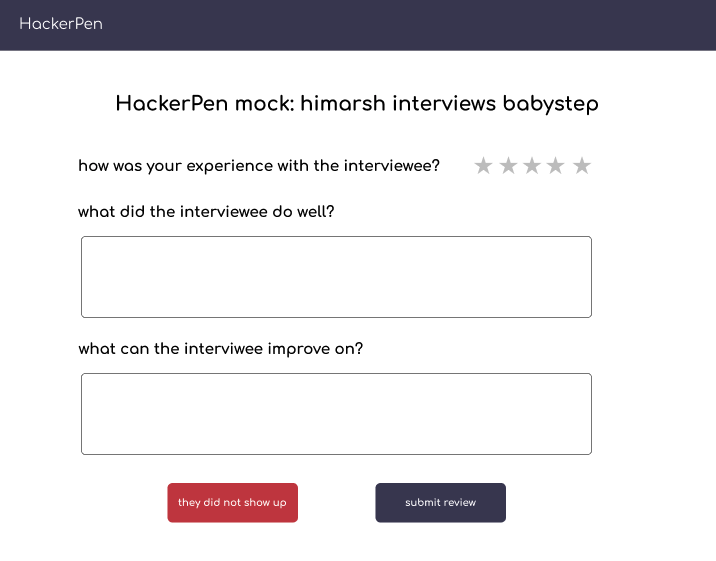

- Start Date: 2022-01-17
- RFC PR: (leave this empty)
- React Issue: https://github.com/HackerPen/rfcs/issues/1

# Summary

After an interview is in the past (i.e. 4 hours after the interview start time), an interviewer or interviewee can leave a review about the interview.

# Basic example

**scenario 1: review interview as an interviewer / interviewee**

Given I am an interviewer / interviewee
When an interview is ended (i.e. 4 hours after interview date)
Then I receive an email to fill out a review
And I can also log into HackerPen dashboard to review an interview


**scenario 2: mock interview ends with no-show**

If one person of a mock interview is a no-show
Then the other person can report the interview as a "no-show"
And it impacts the absent user's reputation

# Motivation

Reviews are important for interviewers and interviewees for different reasons. For interviewers, the reviews help them understand how they can be better in conducting interviews. For interviewees, reviews about interviewers inform them which interviewers are best suited for their needs.

# Detailed design

### UX design

The major design centers on the content of the feedback form. The data points to consider collecting:

- rating of an interview (1 - 5 scale)
- if interview is `finished` (both parties were present), or `absent` (at least 1 party did not show)



### Data model

We need to add a new `interview_reviews` table:

```
table: interview_reviews

id: bigInt
interview_id: bigInt (FK to interview)
reviewer_id: bigInt (FK to user, author of the review)
reviewee_id: bigInt (FK to user, person being reviewed)
rating: int (1-5)
notes: JSON (actual content of review)
```

# Drawbacks

This is first iteration of interview reviews, and the review might not be as fine grained as we want it to be.

# Unresolved questions

- How to handle when an interview is `absent`? How do we track user's reputation?
