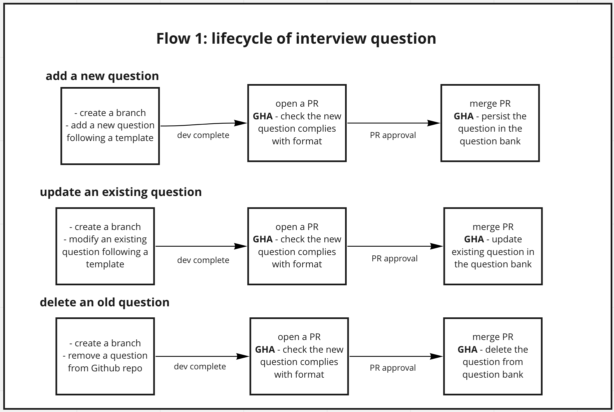
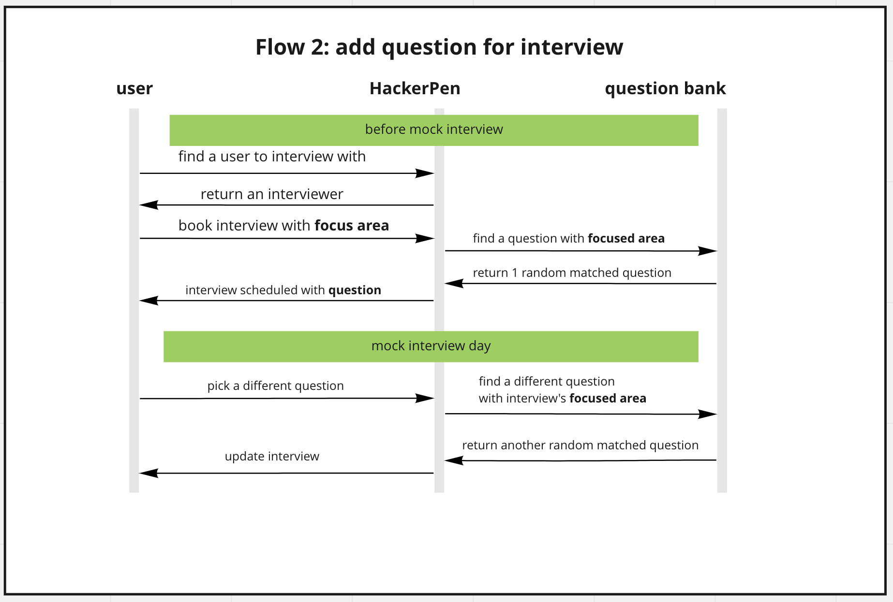

- Start Date: 2022-01-23
- RFC PR: (leave this empty)
- RFC Issue: https://github.com/HackerPen/rfcs/issues/2

**Summary**

This document captures product and tech requirements for building an open-source interview question bank.

**Motivation**

Currently the dominant resource of tech interview questions is LeetCode. However, the type of questions on LeetCode is not best fit for all tech companies. Take-home coding challenge is another option to assess a candidate’s tech skill. However, a good take-home challenging takes time to design, and a candidate might take hours to finish a take-home challenge, mostly without pay.

What if we can have more context-based, rubric-oriented tech questions that aim to assess what’s really needed for a software developer at a company? This RFC aims to build a product to tackle this challenge. This document starts by identifying fundamentals in designing good tech interview questions.

**Questions should be industry-specific**. The knowledge required for building a finance system (e.g. trading or payments) is very different from building a e-commerce system. The questions a company use to assess should factor in these industry differences.

**Good interview questions require feedback and iteration**. Good interview questions need to be iterated and refined. As a company evolves, the skills required will also evolve, which require interview questions to evolve too.

**Best way to iterate on interviews questions is to use them in interviews**. The best way to know if a question works well is to see it in action and collect feedback afterwards. Some companies do this now in actual interviews, but the companies question bank tend to stay static after a company deem their interview questions "good enough".

To address those fundamentals and challenges, the document outlines an open-source tech question bank that integrates with a mock interview platform (i.e. HackerPen), this open-source question bank has the following key characteristics:

- **Questions are industry-based**. The question bank curate questions that assess specific skills required for specific industries. The question should reflect problems that will be worked on at the job. Nevertheless, we are not ruling out traditional data structure & algorithm question, but if those questions were asked, they should be asked in specific business context.
- **Question bank is open-source**. Coming up good content is hard, and a community is smarter than an individual. Based on these two facts, a good sustainable question bank should be constantly evolving, with contributions of people with different experiences.
- **Questions are fully integrated into HackerPen’s mock interview platform**. This goes back to the challenge that “the best way to iterate on questions is to test in interviews”. Given HackerPen already provides a medium for people to do mock interviews, different types of questions can be tested out by the community.

****

**Detailed design**

The open source question bank will be hosted on Github as a public repository, and we will use Github Actions (GHA) to handle the Continuous Integration & Deployment.



The question bank will be directly integrated with [HackerPen's mock interview platform](https://app.hackerpen.io).



GraphQL schemas

```graphql
mutation upsert_question(...) # update or create a question
mutation delete_question(...) # delete a question
query get_question(...) # get one question based on criteria
```

More detailed skecth, note that this is **NOT** the final structure.

To create or update a question:

```graphql
mutation upsert_question(
	id: "unique-question-identifier",
	question_type: "coding",
	description: "markdown description of a question",
	starter_code: [
		{language: "python", code: "python-code..."},
		{language: "javascript", code: "javascript-code..."},
		{language: "C++", code: "cpp-code..."}
	],
	tags: {
		industry: ["FinTech", "EdTech"],
		difficulty: "medium",
		concepts: ["DFS", "dyanmic_programming"]
	}
)
```

To get a question with certain criteria:

```graphql
query get_question(
	industry: ["FinTech"],
	difficulty: "medium",
	question_type: "coding",
	language: "python"
) {
	id description starter_code
}
```

**Drawbacks**

A few challenges when building this service:

- **Initial question volume**. Curating a large amount of quality questions take time. One approach, for starters, is to start with LeetCode, and refactor some questions with industry context.
- **Maintaining question bank quality**. A common guideline needs to be established if this project is open-sourced. One approach is to establish a core team for the open source project and have committee to collectively maintain an agreed-upon level of quality.

**Unresolved questions**

- What should be the tech stack? e.g. Python Flask, Ruby Sinatra on GraphQL
- What should be the data storage? e.g. Postgres, NoSQL (DynamoDB, MongoDB), ElasticSearch.
- What type of taxonomy should we use in categorizing questions? e.g. How to categorize different industries? How to categorize different types of algorithm types?
