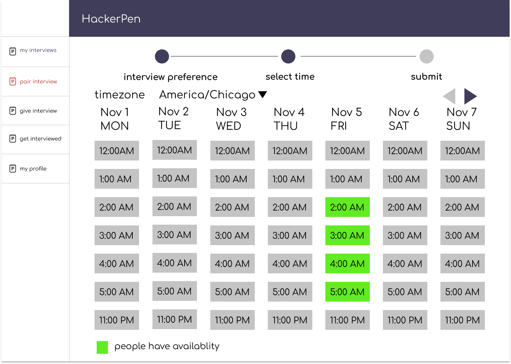
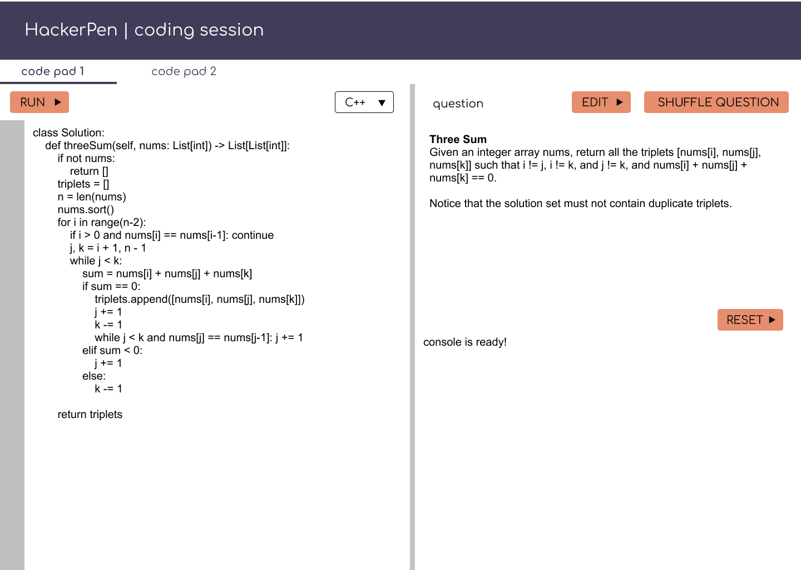
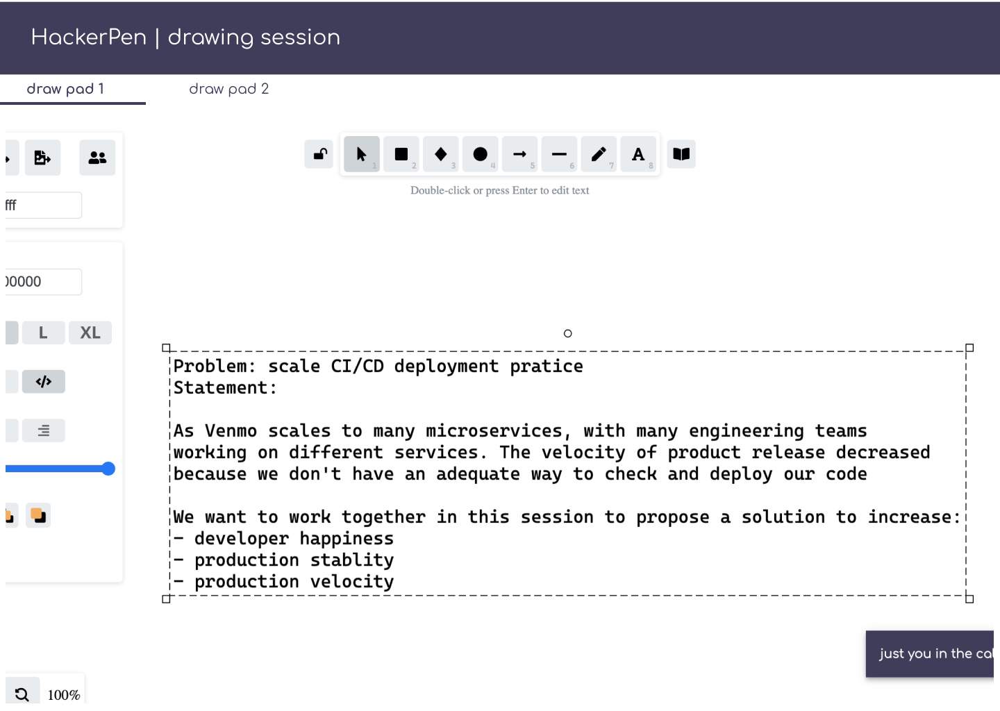

- Start Date: 2022-02-13
- RFC PR: (leave this empty)
- RFC Issue: https://github.com/HackerPen/rfcs/issues/3

# Summary

Pair interview allows users to pair up with one another to interview each other (i.e. give an interview, receive an interview).

# Basic example

Two new experience flows will be added in this feature: **schedule matching** and **pairing session**

## schedule matching

A user can match for a pairing interview:

- user sign into HackerPen, click "pair interview"
- user sees a list of timeslots for 30 days, and they can choose up to X timeslots when they are available
- in the background, a interview matching job runs every hour. If there's a match, it creates an interview and notifies both users.

## pairing session**

An interview session would also change to accommodate pairing interview:

From database perspective:
- **one** interview session has **many** code pads (previously only 1)
- **one** interview session has **many** draw pads (previously only 1)

To accommodate pairing interview:
- 1 interview session has 2 code pads
- 1 interview session has 2 draw pads

This also means that the number of pads associated with a session is configurable.

# Motivation

Right HackerPen only allows one-side interview - either give or receive an interview. There is over demand of receiving interview. The intent of pairing interview is to bridge the gap of supply and demand on mock interview, thereby increasing the number of mock interviews.

# Detailed design

**schedule matching**

To encourage people to match up for mock interviews, the user experience provides options for users. By default, users can book any time. If there is an existing user with the same time slot with the same interview preference (e.g. I want to have a coding interview), then the user will be matched right away.

If the user is not being matched right away, that time slot will be marked as open for future users to match.

**pairing session design**

In a 2-person pairing session, two code pads and two draw pads will be provided so that when uses switch roles, they can use a new pad for a new mock interview session.

# Other considerations

When building out the pair interview feature, product scalability is top priority. Specifically, ask the following question throughout the implementation:

- Can the added feature expand beyond mock interviews? For example, if we want to use "pairing interview" feature for SaaS-based tech interview software, how would it change the implementation? What about expand HackerPen to online education software for teach coding?

- What parts of the added feature can be open sourced as a core product? For example, schedule matching is solely a mock interview and should not be implemented as part of the core product eligible for open source.
