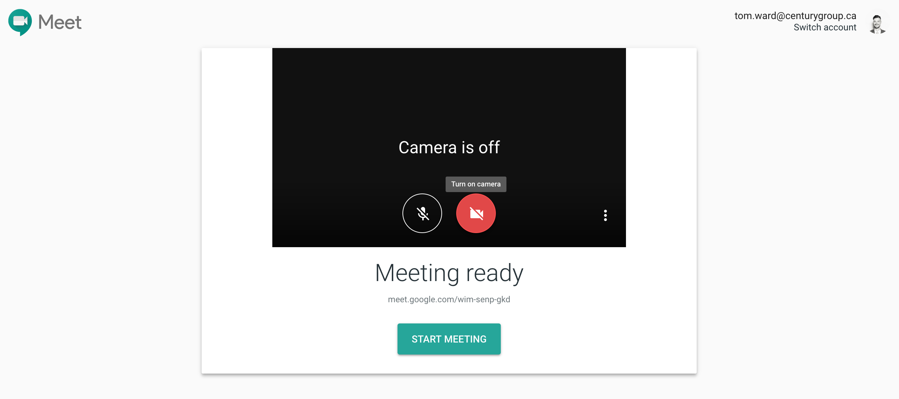
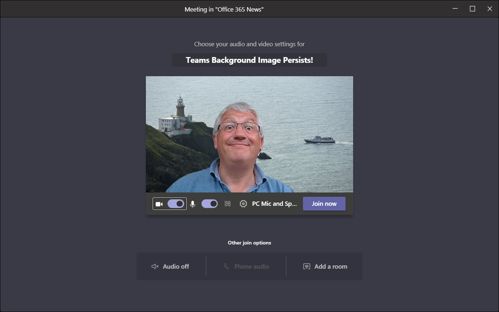
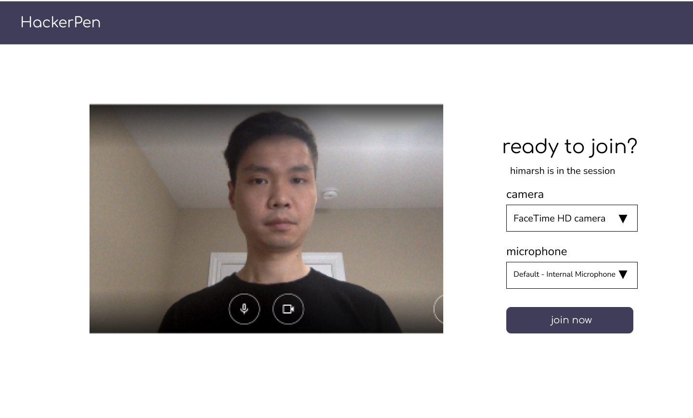

- Start Date: (fill me in with today's date, YYYY-MM-DD)
- RFC PR: (leave this empty)
- RFC Issue: (leave this empty)

# Summary

For each live session, before entering, a user will first land in a preview page.

# Basic example

# Motivation

Having a preview provides a better experience to user in following ways:

- they can check their audio and video prior joining the call
- users can know ahead of time who is already in the call

# Detailed design

- User flow. Session Preview screen.
- User flow. Check audio and video. ([Navigator.MediaDevices](https://developer.mozilla.org/en-US/docs/Web/API/Navigator/mediaDevices))

# Unresolved questions

- How to switch audio and video inside a session?
- How to add visual effects to videos in the future?
