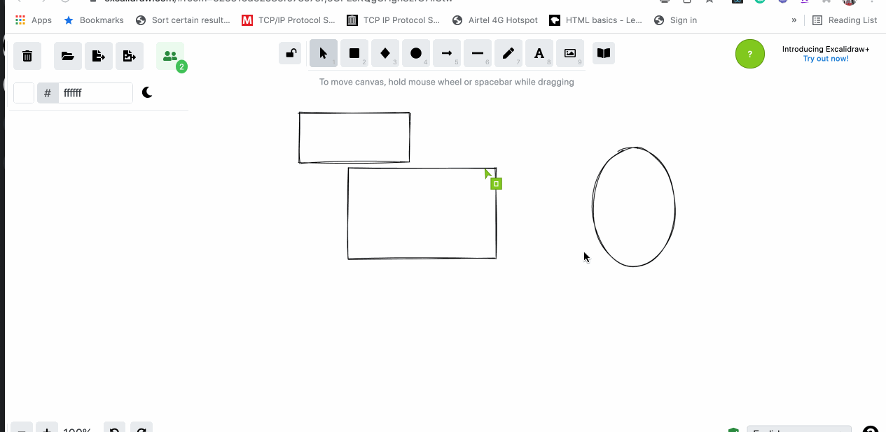
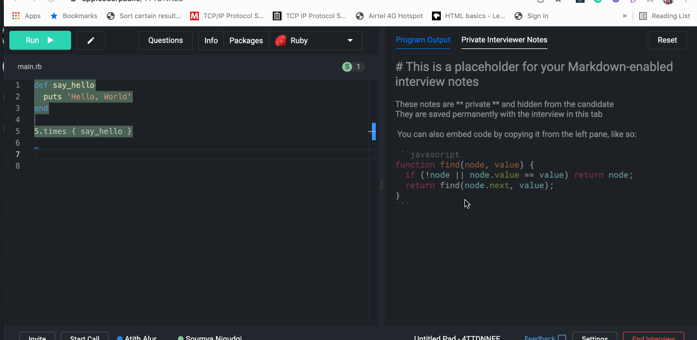

- **Start Date:** 2022-02-26
- **Design link:** (Figma link)
- **RFC PR:**
- **RFC Issue:**

# Summary

Implement real-time cursor and text/components highlighting for the CodePad and DrawPad.

# Basic example

### Excalidraw inspiration

### CoderPad inspiration

# Motivation

Real-time cursor and highlighting features make the user interaction more real-time and help follow other people's activities. More specifically, it's confusing to follow when more than one person participates in a session.

# Detailed design

## Display Users
* List all the active users of a session
* Create an avatar with the initials for all the users
* Assign a unique color to every user
* Update the list when a user enter and exit a session

## CodePad
* Provide a cursor for all the users of a session
* Color the pointer with the color assigned to a user
* When a user selects a component, highlight it with the user color

## DrawPad
* The IDE should update the cursor position when any of the users changes it
* Highlight the selected code for all the users
* Highlight the user avatar who is currently typing

# Drawbacks

- It makes it difficult for the app to work if the connection is slow
- Increases code complexity: Frontend and Backend

# Unresolved questions

- Is WebRTC or WebSockets better to implement this?
- How to deal with slow connections?
