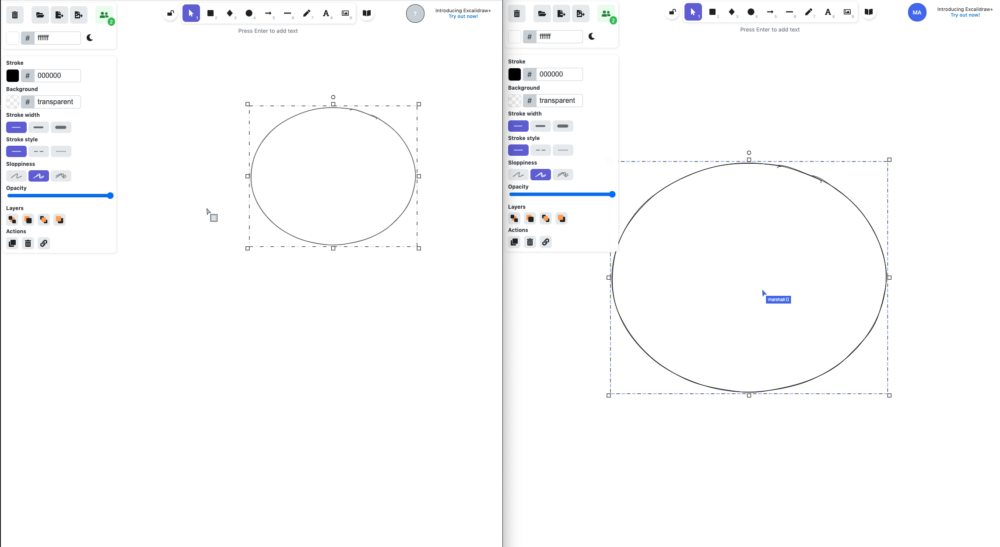

- Start Date: 2022-02-26
- Design link: (Figma link)
- RFC PR: (leave this empty)
- RFC Issue: (leave this empty)

# Summary

Have real time cursor update for both codepad and drawpad.

# Basic example

### Excalidraw inspiration

### CoderPad inspiration

# Motivation

Real time cursor updates gives people idea where other users is at, it drives more real-time engagements.

# Detailed design (TBD)

This is the bulk of the RFC. Explain the design in enough detail for somebody
familiar with React to understand, and for somebody familiar with the
implementation to implement. This should get into specifics and corner-cases,
and include examples of how the feature is used. Any new terminology should be
defined here.

# Drawbacks (TBD)

Why should we *not* do this? Please consider:

- implementation cost, both in term of code size and complexity
- whether the proposed feature can be implemented in user space
- the impact on teaching people React
- integration of this feature with other existing and planned features
- cost of migrating existing React applications (is it a breaking change?)

There are tradeoffs to choosing any path. Attempt to identify them here.

# Unresolved questions (TBD)

Optional, but suggested for first drafts. What parts of the design are still
TBD?
